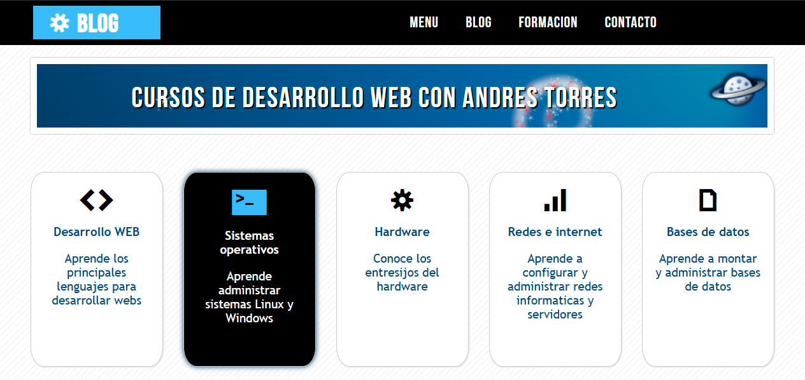
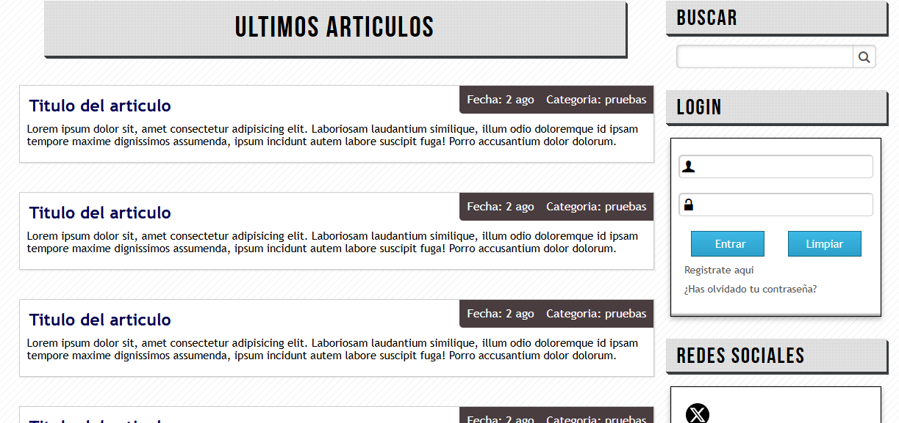
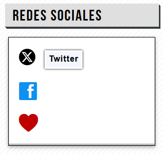

# 🛍️ Blog Personal Servicios

 <!-- Puedes subir una imagen y cambiar el nombre -->

## 📋 Descripción

Este es un proyecto de frontend que representa un blog personal dando a conocer los servicios que se ofrece como desarrollador

## 🚀 Tecnologías utilizadas

- HTML5
- CSS3 

## 🎯 Características principales

- Blog personal
- Tarjetas con efectos para mostrar los servicios
- Animaciones

# Menu de redes desplegable


## 💻 Cómo verlo

Puedes ver el proyecto en vivo aquí:  
🔗 [Ver demo en GitHub Pages](https://iandrestm.github.io/proyecto-blog-personal/)

O clona el repositorio para ejecutarlo localmente:

```bash
git clone https://github.com/iAndresTM/nombre-del-repositorio.git
